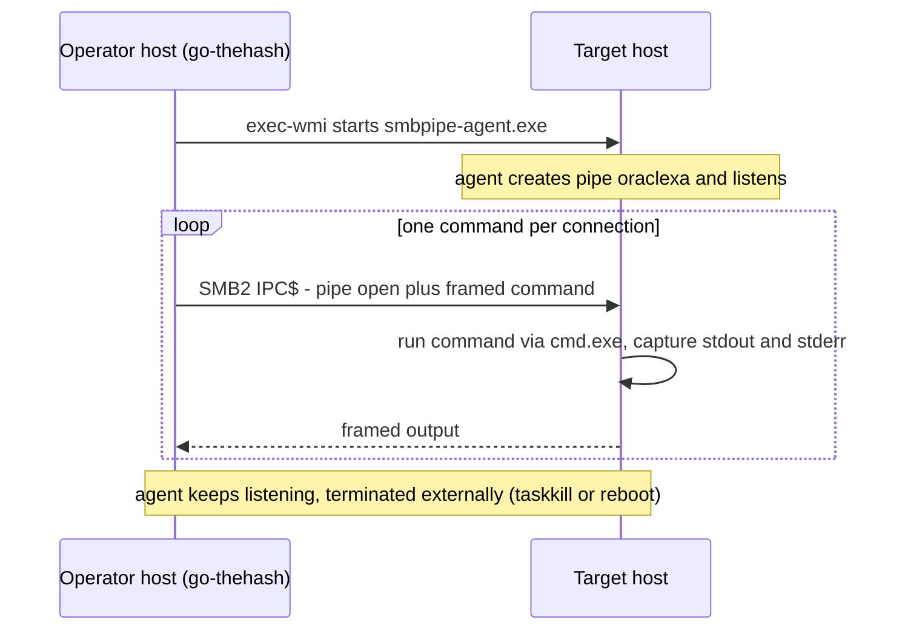

# smbpipe-agent

**Purpose:** Standalone named-pipe C2 agent — listens on `\\.\pipe\<name>` on a Windows host and executes commands sent by a remote SMB client. Pairs with the `pipe` subcommand of go-thehash (`../go-thehash/`), which acts as the operator-side client.

## Overview

The agent creates a byte-mode duplex named pipe and serves it in a single-instance accept loop: `CreateNamedPipeW → ConnectNamedPipe → handshake → serve one encrypted command → flush/disconnect → recreate`. Each connection starts with a 16-byte salt exchange that derives per-connection AES-256-GCM keys (static X25519 ECDH, pinned peer keys); every command/output frame afterwards is encrypted. The agent runs commands via `cmd.exe /c`. The default pipe name masquerades as an Oracle XA transaction service endpoint (T1036.005), and traffic rides tcp/445 inside a normal SMB session — invisible to network IDS focused on HTTP/TLS.

### Source layout

| Path | Responsibility |
|---|---|
| `main.go` | accept loop + connection lifecycle + `cmd.exe` execution |
| `internal/pipeio/` | overlapped Win32 I/O with per-operation deadlines; pipe creation + DACL |
| `internal/securechan/` | protocol layer: ECDH/HKDF key derivation, AEAD framing, handshake |

The client-side mirror of the protocol is go-thehash's `../go-thehash/internal/pipechan/` package — the two are separate Go modules; keep them in sync when changing either (see "Mirror drift" below).

### Division of labor with go-thehash

The two binaries are deliberately split server/client:

| Role | Binary | Responsibility |
|---|---|---|
| Target side | `smbpipe-agent.exe` (this tool) | create + guard the pipe, execute received commands |
| Operator side | `go-thehash.exe pipe` | SMB connect over IPC$ with PtH credentials, frame and send one command, print framed output |

The agent is passive — it never initiates connections, so it can be staged onto a host beforehand or started via any process-creation primitive (e.g. go-thehash `exec-wmi`). The pipe name is fixed in both sides' source (`oraclexa`); changing it requires rebuilding both.

## Deployment & lifecycle



- **No SCM handler:** the agent is a regular console process, not a `windows/svc` service. Launch it with a process-creation primitive (`go-thehash exec-wmi` / WMI), **not** `go-thehash exec`. `exec` registers the agent binary as a transient service via MS-SCMR; because the agent never calls `StartServiceCtrlDispatcher`/`SetServiceStatus`, SCM returns `ERROR_SERVICE_REQUEST_TIMEOUT` (1053) after ~30 s and **terminates the service process** — i.e. the agent itself dies (observed in the lab: agent spawns, then disappears). If a service entry is ever required for scoring, point `ImagePath` at a detaching wrapper instead (`cmd.exe /c start "" C:\Windows\Temp\smbpipe-agent.exe`) so SCM kills only the wrapper and the detached child survives. No service lifecycle management is implemented or needed.
- **Sequential by design:** one connection at a time, matching the one-command-per-invocation client. Per-connection errors are logged and swallowed; a dead listener is recreated by an internal 1-second retry loop rather than exiting.
- **Termination is external** (`taskkill`, service stop, reboot) — there is no signal handling.

## Wire protocol

Byte-mode pipe (not message-mode) — byte mode because SMB2 `FSCTL_PIPE_TRANSCEIVE` and `ReadFile`/`WriteFile` behave reliably over byte-mode pipes across the network.

**Handshake (plaintext, once per connection):**

```
client → agent : [4 bytes uint32 LE len=16][16-byte random salt]
both sides     : HKDF-SHA256(X25519(static keys) ECDH, salt) → two directional AES-256-GCM keys
```

**Encrypted frames (everything after the handshake):**

```
[4 bytes uint32 LE len][12-byte nonce][ciphertext + 16-byte GCM tag]
```

- The length header is used as AEAD associated data (tamper-evident).
- Nonce = 4-byte random per-direction prefix ‖ 8-byte strictly increasing counter → replay protection without clock sync; distinct directional keys eliminate cross-direction collisions.
- Static ECDH keys are baked into both binaries at build time and pinned to each other. Regenerating them means rebuilding **both** sides together. There is deliberately no forward secrecy.
- Size caps enforced on both ends against OOM: commands ≤ 64 KB, frames ≤ 16 MB.
- All agent-side I/O is overlapped with a 10 s per-operation deadline — a stalled or half-open connection can never pin the listening slot indefinitely.

### Root cause: why `CreateNamedPipeW` directly (not go-winio)

Two independent root causes had to be fixed before the channel worked end-to-end; both are preserved here because any refactor risks reintroducing them:

1. **Server side — go-winio rejects all remote clients.** `github.com/Microsoft/go-winio` (all versions, including v0.6.2) hardcodes `FILE_PIPE_REJECT_REMOTE_CLIENTS` in `pipe.go` (`makeServerPipeHandle`). NPFS then rejects **every SMB-originated client** with `STATUS_ACCESS_DENIED` while local clients connect fine — observed as `go-thehash pipe` failing with "Access denied!". The fix is to call `windows.CreateNamedPipeW` directly without that flag. Sliver solves the same problem by pinning a fork (`lesnuages/go-winio v0.4.19`) whose `PipeConfig.RemoteClientMode` clears it.
2. **Client side — go-smb opens pipes read-only.** go-smb's default `NewCreateReqOpts()` builds a DesiredAccess mask with only read rights; writing a command onto such a handle makes some SRV2 builds drop the underlying TCP connection instead of returning `STATUS_ACCESS_DENIED`, which the client surfaces as a bare `EOF`. The fix lives in go-thehash `execViaPipe`: open via `OpenFileExt` with `FAccMaskFileWriteData` included.

Both causes were confirmed independently in the lab before fixing: a .NET `NamedPipeClientStream` connected successfully against the agent both locally and cross-host over SMB while go-smb failed — proving the pipe/DACL were sound and isolating one fault to each library layer above.

### Mirror drift: the duplicated protocol layer

The protocol is implemented twice — `internal/securechan/` here, `../go-thehash/internal/pipechan/` on the client. This has already bitten once: the first client port omitted one line (`append(nonce)` in `seal`), producing frames the other side read as `[header][ciphertext]`. The failure surfaced only in the server→client direction and as a misleading `unexpected nonce counter` error, because a length-header check passed on a partially-filled buffer. Lessons:

- A frame-layout change must be applied to **both** modules and both directions in the same change; grep for `seal(` / `open(` in both trees before rebuilding.
- Symptom triage order: `frame too short` → framing/layout; `header mismatch` → length accounting; `nonce counter` → either counter state or (historically) nonce placement; `authentication failed` → key derivation mismatch.
- If the protocol evolves further, consider extracting it into a shared Go module to eliminate the duplication entirely.

### Lab verification status

The encrypted channel (protocol v2) was verified end-to-end in the lab: agent staged on DC01 via go-thehash `exec-wmi`, operator-side `pipe` command over SMB with PtH credentials returned encrypted `whoami` output. Earlier failures during bring-up were stale-process issues (old plaintext agent still holding the pipe name), not protocol faults — always `taskkill` all instances before restaging.

### Design notes

- **`FILE_FLAG_FIRST_PIPE_INSTANCE`** on the first instance: NPFS allows multiple same-named pipe instances and hands clients out FIFO, so a malicious process could pre-create the name and intercept connections. The flag makes the first create fail if the name already exists, closing that hijack window — see csandker.io, "Offensive Windows IPC Internals 1: Named Pipes".
- **DACL** `D:P(A;;GA;;;BA)(A;;GA;;;SY)` — GENERIC_ALL to BUILTIN\Administrators and SYSTEM only, protected against inheritance.

## Target context

- **Host / OS / arch:** any Windows x64 host reachable over SMB from the operator side
- **Privilege required:** run as Administrator/SYSTEM (the DACL only allows BA/SY to connect); typically started via WMI from go-thehash (`exec-wmi`)

## Usage

On the target host (agent):

```powershell
.\smbpipe-agent.exe
# [+] Listening on \\.\pipe\oraclexa
```

From the operator-side host (client, go-thehash — PtH as a local/domain admin of the target):

```powershell
☣️ .\go-thehash.exe pipe <target-host> <DOMAIN>\<user> <NT-hash> oraclexa "whoami"
```

One command per connection; the client exits after printing the response.

## See also

- Build: `Build.md` · Sliver design/stealth comparison: `comparison-sliver.md`
- Client implementation: `../go-thehash/` (`pipe` subcommand)
- Client code flow & ATT&CK mapping (covers this agent's channel side): `../go-thehash/Flow.md` — C2 over non-app-layer protocol T1095, Encrypted Channel T1573.002 (ECDH handshake) / T1573.001 (AES-GCM frames); masquerading pipe name T1036.005
